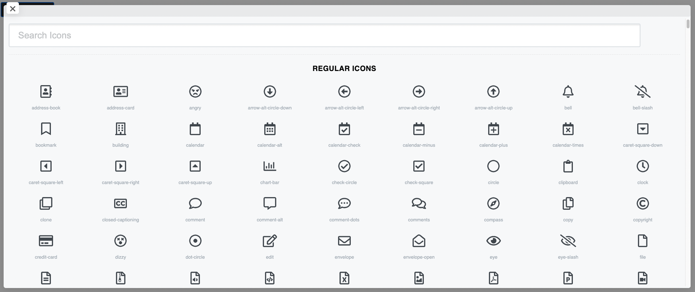

# Vue Icon Picker

A Vue.js icon picker component to easily pick FontAwesome 5 Icons.
Currently, only the free version of FontAwesome5 is available.




## Table of contents

- [Installation](#installation)
- [Usage](#usage)
- [Configuration](#configuration)
    - [Options](#options)
- [Events](#events)

## Installation

Install using `npm`   

```
npm install --save @aalicki/vue-icon-picker
```

Then Register The Component Globally:

```javascript
import Vue from 'vue';
import VueIconPicker from '@aalicki/vue-icon-picker';

Vue.component('vue-icon-picker', VueIconPicker)
```

OR use it in a Component:

```javascript
import VueIconPicker from '@rightbraintechbd/vue-icon-picker';

export default {
    name: 'YourFeatureComponent',
    components: {
        'vue-icon-picker': VueIconPicker
    },
}
```


## Usage

Usage:

```html
<vue-icon-picker />
```


## Configuration

You can also pass Options as props in the `vue-icon-picker` component as you can see the example below

```html
<vue-icon-picker :icon-preview="false" />
```


### Options

```javascript
/**
 * The Text which will be shown to the Button
 */
button: {
    type: String,
    default: 'Pick A Icon'
},

/**
 * Button Background Color
 */
bgColor: {
    type: String,
    default: '#212121'
},

/**
 * Button Text Color
 */
txtColor: {
     type: String,
     default: '#e1e1e1'    
}

/**
 * Whether the Icon should be displayed after selection
 */
iconPreview: {
    type: Boolean,
    default: true
}
```

Example for setting the background color (note that the hexidecimal codes can be short or long form):

```html
<vue-icon-picker bgColor="#fff" txtColor="#000000"/>
```

## Events

VueIconPicker will emit a `selected(icon)` event when user selects an icon.

```html
<vue-icon-picker @selected="onIconSelected" />
```

```javascript
{
    methods: {
        onIconSelected(icon) {
            // your code here
        }
    }
}
```

It will emit an `Object` containing icon data like `{ type, name }` 

```javascript
{ type: 'fab', name: 'facebook' }
```

## Roadmap & Plans
- Clean up SASS
- Optimize picker to be more responsive
- Night mode
- Allow you to easily clear the icon if preview is enable with a triggered event.
- Allow you to limit types of icon results (Branding, Regular, Solid, etc...)

This is my first Open Source project, I'll happily take in feedback, requests and issues.

[MIT](http://opensource.org/licenses/MIT)